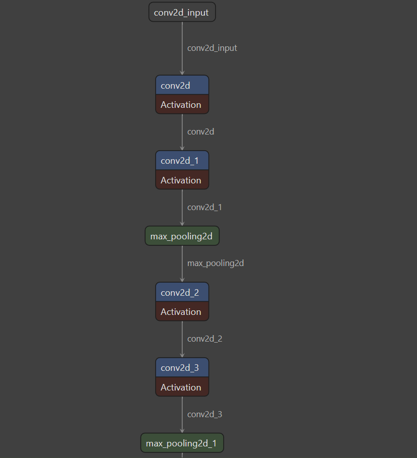
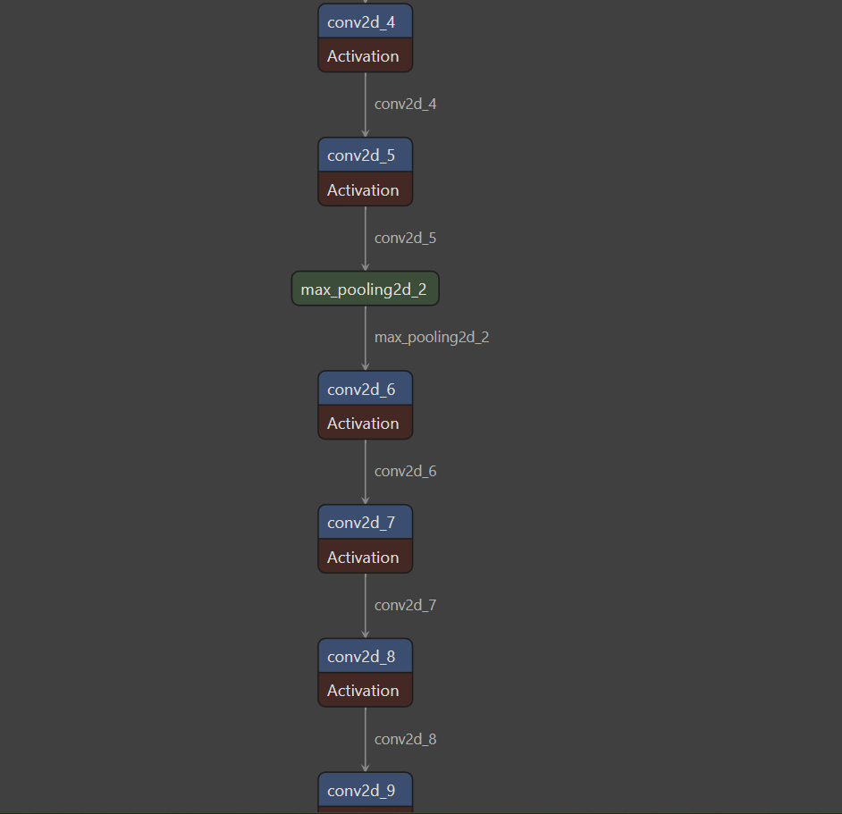
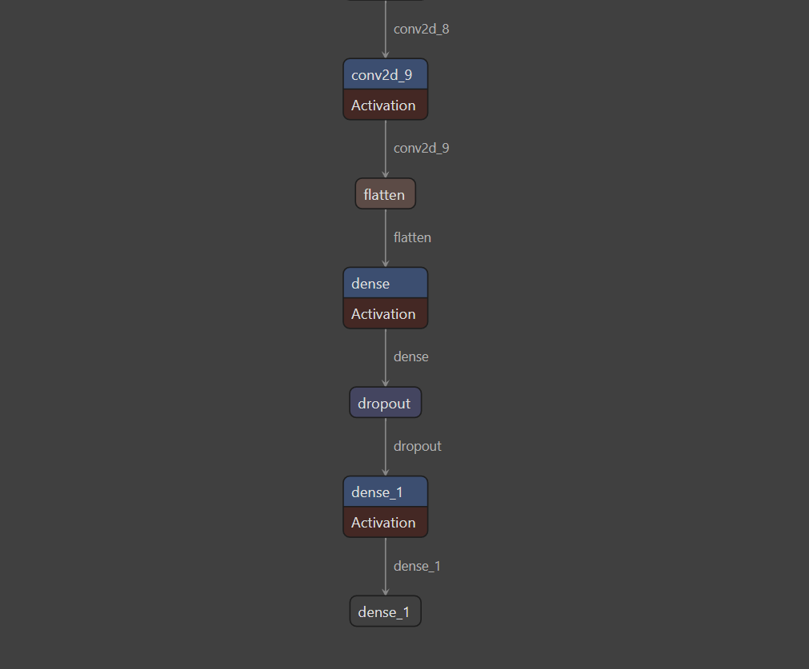
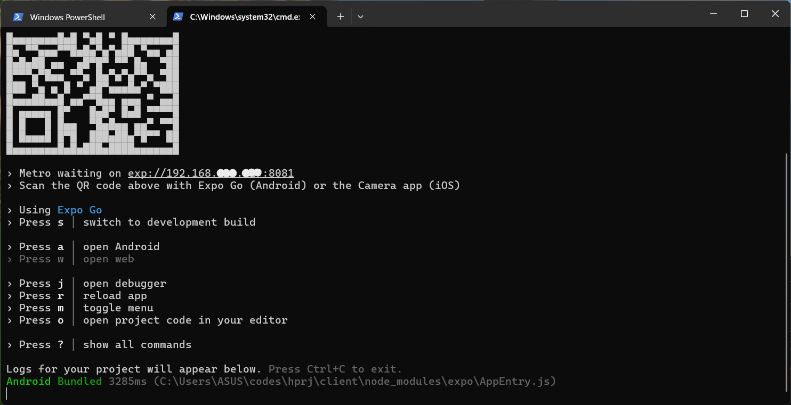
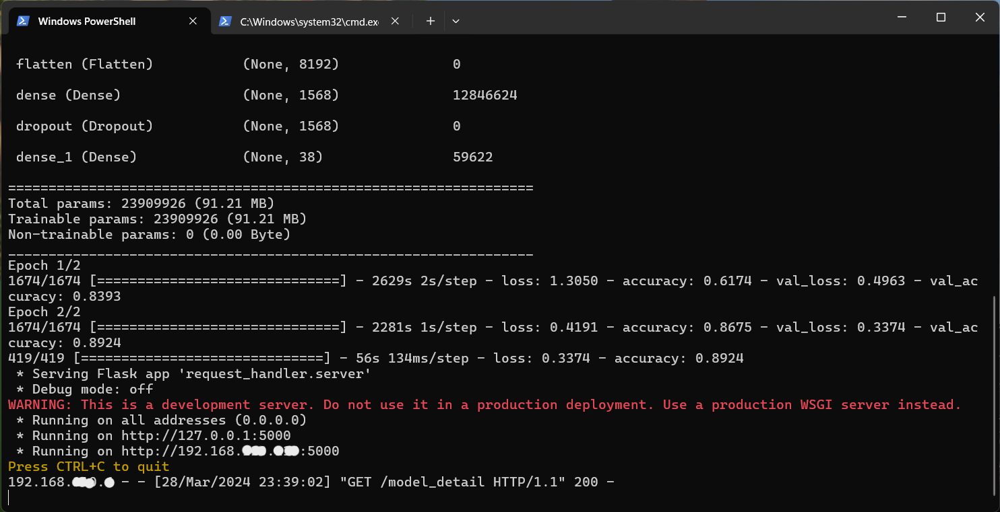
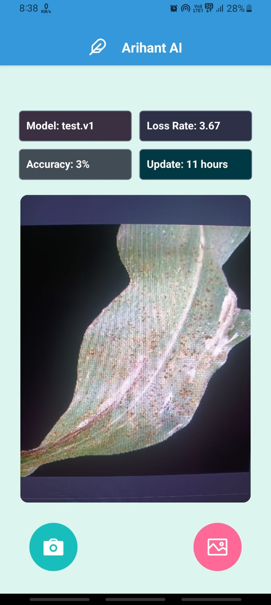
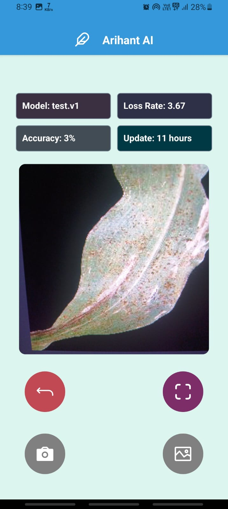
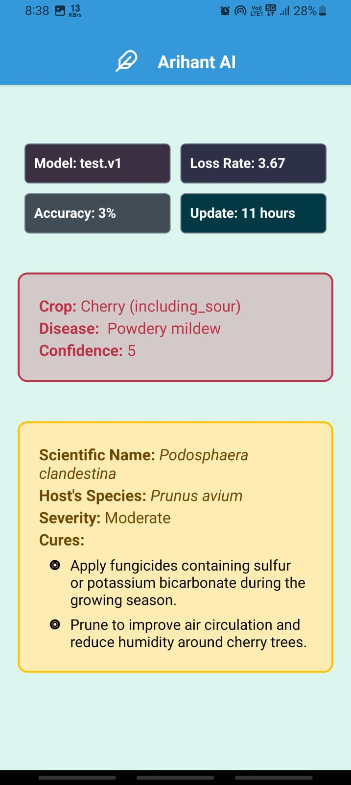

# Arihant AI

## Description

Fullstack app for Crop disease detection and solution suggestion AI. This app is made during CIC Build-A-Thon Hackathon.

## Preview

<video width="240" height="570" controls>
  <source src="./screenshots/v1.mp4" type="video/mp4">
</video>

## Participant details
| Name                | Registration number | Effective Role | Institution |
|---------------------|---------------------|----------------|-------------|
| Prabuddh Raj Pandey | 12109163            | Team Leader    | LPU         |
| Vaibhav Jain        | 12116035            | Developer      | LPU         |
| Surya Singh         | 12114479            | Developer      | LPU         |

### Selected Problem Statement

AGRICULTURE, FOODTECH & RURAL DEVELOPMENT :
Developing solutions, keeping in mind the need to enhance the primary sector of India - Agriculture and to manage and process our agriculture produce.

### Solution

* __AI Model Integrated App__: An android app in local languages powered by continous Artificial Intelligence and Machine Learning system to provide Real-Time precise crop diseases

* __24 Hours Auto Refresh__: Self-Training Model attached on the server to auto-refresh and retrain datasets every 24 hours

* __Cure Suggestion Integration__: App does also provide solutions for disease using integrated API

### Model details

* Dataset used : [New Plant Disease Dataset](https://www.kaggle.com/datasets/vipoooool/new-plant-diseases-dataset)

* 7-layerd convulational neural network (CNN)

* Trained on more than 70000 files of 30 classes

* Tested and validated on 30000 files of 8 classes

* Average accuracy achieved of 89% (approximate)

* Maximum confidence achieved is 60%

* Minimum loss achieved 0.06

* Optimized model size is 300MB (approx)

### Model architecture (7-Layer model)








## Technologies used

### For Android app

* React
* React native
* React Navigation
* React Native Reanimated
* rneui
* expo

### For server

* Flask (would be later replaced by gunicorn)
* Tensorflow
* Numpy
* Matplotlib
* Werkzeug

### For deployment
* Docker

## How to run?

### Self train and host

* Local machine method (stable)

    

    * in console 1

    ```sh
    git clone https://github.com/0x0is1/ArihantAI
    cd ArihantAI
    cd server
    python app.py
    ```

    * in console 2

    

    ```sh
        cd ArihantAI
        cd client
        npm start
    ```

    * __Remember to put your self hosted server's address in the below in home page__

    * Now you are ready to use the app.
    * Scan the QR code displayed on the console with Expo Go app in your phone

* Docker method

    * in console 1

    

    ```sh
    git clone https://github.com/0x0is1/ArihantAI
    cd ArihantAI
    docker build -t arihant .
    docker run -d -p 5000:5000 arihant:latest
    ```

    * in console 2

    

    ```sh
        cd ArihantAI
        cd client
        npm start
    ```

    * __Remember to put your self hosted server's address in the below in home page__

    * Now you are ready to use the app.
    * Scan the QR code displayed on the console with Expo Go app in your phone

## Download Built Apk (Unstable)

We are working on the build app yet as the server is not fixed for use. We will release an stable version soon but as of now, you can test the prototype [here](https://expo.dev/artifacts/eas/vULn8pbB4Ykbh3ycigysmE.apk)

## Preview






